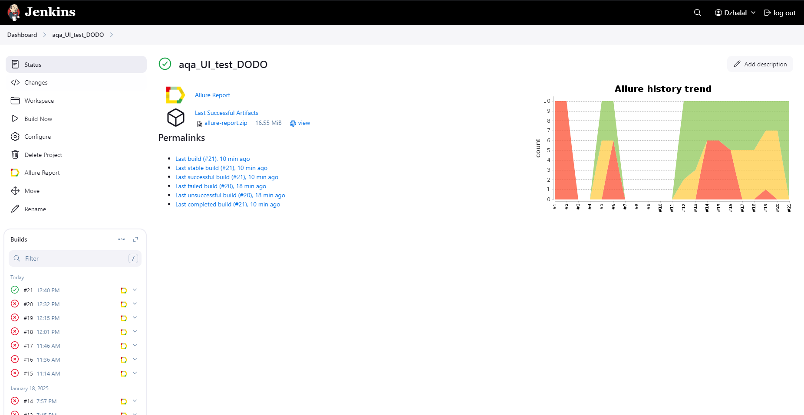
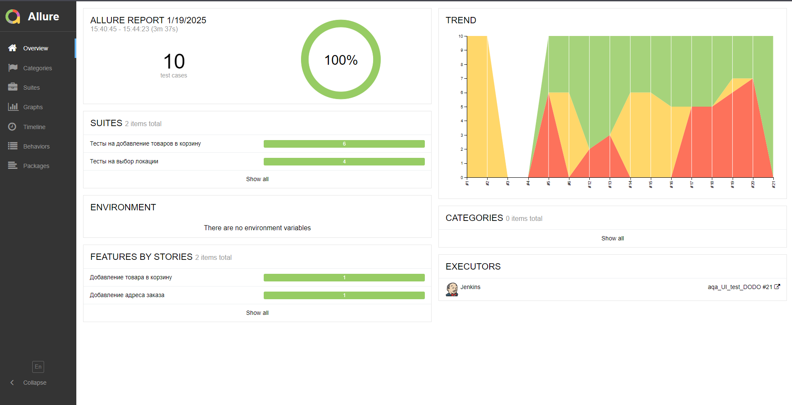
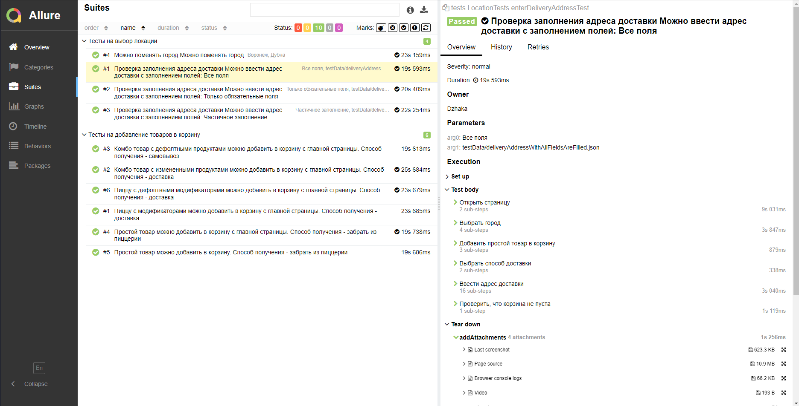
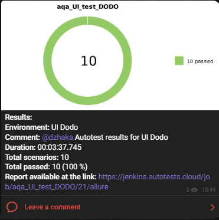
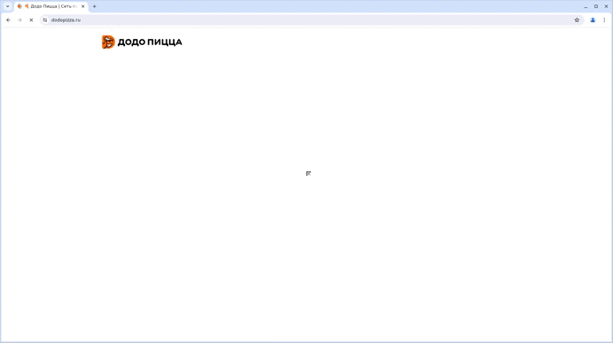

# Проект по автоматизации тестирования UI для сайта компании [Додо Пицца](https://dodopizza.ru/)
<p align="center"><a href="https://dodopizza.ru/"></a></p>


## :pushpin: Содержание:
___
+ [Стек технологий](#briefcase-стек-технологий)
+ [Запуск автотестов](#bow_and_arrow-запуск-автотестов)
+ [Сборка в Jenkins](#-сборка-в-jenkins)

____
## :briefcase: Стек технологий

<p align="center">
<a href="https://www.jetbrains.com/idea/"></a>
<a href="https://github.com/"></a>  
<a href="https://www.java.com/"></a>
<a href="https://gradle.org/"></a>  
<a href="https://junit.org/junit5/"></a>
<a href="https://selenide.org/"></a>
<a href="https://rest-assured.io/">  </a>
<a href="https://www.jenkins.io/"></a>
<a href="https://github.com/allure-framework/"></a>
<a href="https://telegram.org/"></a>
<a href="https://aerokube.com/selenoid/"></a>
</p>

___
+ IntelliJ IDEA - Интегрированная среда разработки программного обеспечения
+ Java - язык программирования, который был использован для написания автотестов
+ Selenide - фреймворк для написания автотестов
+ Selenoid - приложение, использованное для удаленного запуска браузеров
+ Allure Report - для формирования отчетов
+ Gradle - сборщик кода
+ JUnit - фреймворк для автоматического тестирования программ
+ GitHub - удаленный репозиторий для хранения кода
+ Jenkins - сервер для удаленного запуска тестов
+ Telegram - платформа для обмена сообщениями, куда будут приходить отчеты запуска тестов

___
**Содержание Allure-отчета:**
* Шаги теста;
* Скриншот страницы на последнем шаге;
* Page Source;
* Логи браузерной консоли;
* Видео выполнения автотеста.

## :bow_and_arrow: Запуск автотестов
___
**Команда запуска тестов локально, из терминала**
```
gradle clean test -Denv=local
```
---

## <a href="https://www.jenkins.io/"></a> [Сборка в Jenkins](https://jenkins.autotests.cloud/job/aqa_UI_test_DODO/)
**Шаги для запуска тестов:**
1. Зайти в сборку
2. Перейти в раздел <code>Собрать с параметрами</code>
3. Выбрать необходимые параметры
4. Нажать кнопку <code>Собрать</code>

<p align="center">

</p>

___
## <a href="https://github.com/allure-framework/"></a> [Пример Allure-отчета](https://jenkins.autotests.cloud/job/aqa_UI_test_DODO/21/allure/)


<p align="center">

</p>

<p align="center">

</p>

___

### <a href="https://telegram.org/"></a> Уведомления в Telegram с использованием бота

После завершения сборки специальный бот, созданный в <code>Telegram</code>, автоматически обрабатывает и отправляет сообщение с отчетом о прогоне тестов.

<p align="center">

</p>

### <a href="https://aerokube.com/selenoid/"></a> Видео примера запуска тестов в Selenoid

В отчетах Allure для каждого теста прикреплен не только скриншот, но и видео прохождения теста
<p align="center">
  
</p>